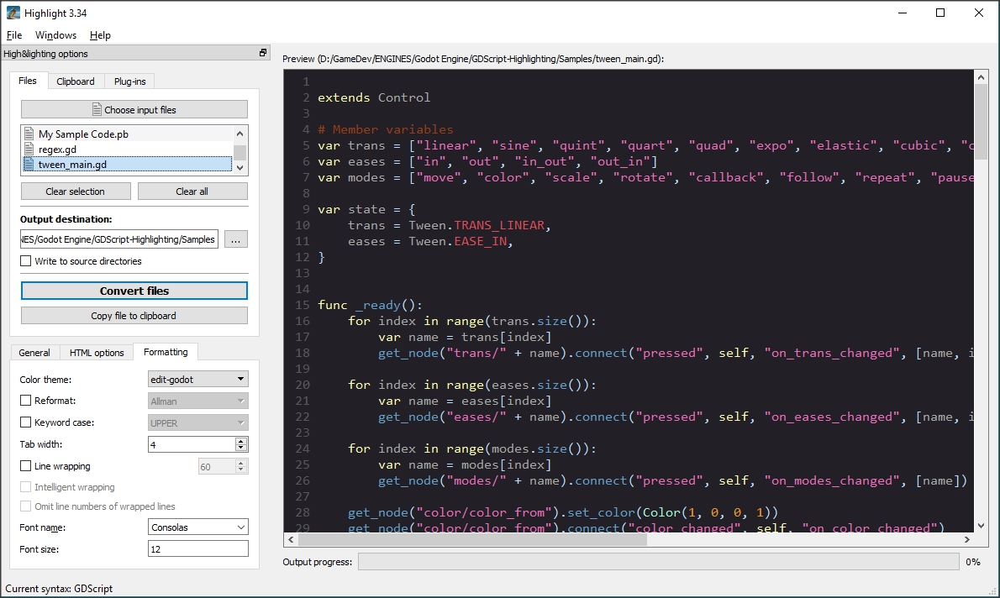

GDScript Highlight
==================

    GDScript    v1.0
    Godot Theme v1.0

GDScript language definition and theme for André Simon’s **Highlight** tool:

-   <http://www.andre-simon.de/>

By [Tristano Ajmone](https://github.com/tajmone/) (2017/02/16). Released under the public domain according to the [Unlicense](./LICENSE) license terms (with the exception of the third party [GDScript sample code](#license-notice), used for testing purposes, which is MIT licensed).

Also contains an [`/extras/`](./extras/) folder with dev-notes and resources for porting GDScript syntax or Godot theme to other libraries.

Project home:

-   <https://github.com/tajmone/gdscript-highlight>

------------------------------------------------------------------------

<!-- #toc -->
-   [Introduction](#introduction)
-   [Manual Setup](#manual-setup)
-   [Extra Resources](#extra-resources)
-   [License Notice](#license-notice)
-   [Third Party Resources](#third-party-resources)
    -   [Other Syntax Highlighters](#other-syntax-highlighters)
        -   [GitHub Linguist](#github-linguist)
    -   [Text-Editors Supporting GDScript](#text-editors-supporting-gdscript)
        -   [GDScript-Sublime](#gdscript-sublime)
        -   [Atom’s lang-GDSCript](#atoms-lang-gdscript)

<!-- /toc -->

------------------------------------------------------------------------

Introduction
============

This repository contains the GDScript language definition file for **Highlight** tool, plus a theme mimicking Godot’s native editor default theme:

-   `gdscript.lang` — The GDScript lang definition file.
-   `edit-godot.theme` — Godot Theme.

Here’s a screenshot of how GDScript code is rendered in **Highlight GUI**’ preview:

And this is a screenshot of the same code in Godot’s editor:

There’s also an [html converted example file](./extras/example.html) of the source seen in the above screenshot. For a live preview in GitHub, [click on this link](http://htmlpreview.github.io/?https://github.com/tajmone/gdscript-highlight/blob/master/extras/example.html).

> **NOTE**: The code in the above examples was taken from the Godot’s demo-projects repository: [`/misc/tween/main.gd`](https://github.com/godotengine/godot-demo-projects/blob/master/misc/tween/main.gd) — (c) by J.Linietsky and A.Manzur, MIT License.

Manual Setup
============

Manual setup is only required while waiting for GDScript to become part of **Highlight**’s official bundle.

    Highlight/langDefs/gdscript.lang              <= copy file to here
    Highlight/themes/edit-godot.theme             <= copy file to here
    Highlight/filetypes.conf                      <= edit file 
    Highlight/gui_files/ext/fileopenfilter.conf   <= edit file 

Copy “`gdscript.lang`” in Highlight’s “`langDefs`” folder, and “`edit-godot.theme`” in the “`themes`” folder.

Open **Highlight**’s “`filetypes.conf`” file in a text editor and add the following line somewhere before the closing bracket (`}`) at the end of the file:

     { Lang="gdscript", Extensions={"gd"} },

Edit the “`fileopenfilter.conf`” file found in Highlight’s “`gui_files/ext/`” folder, and add the following line:

    GDScript (*.gd)

… the last two changes will associate the “`*.gd`” file extension with GDScript syntax. For more info, see:

-   <http://www.andre-simon.de/doku/highlight/en/highlight.php#ch3_7>

Extra Resources
===============

-   [`/extras/`](./extras/)

In the [`/extras/`](./extras/) folder you will also find some developer-notes and resources useful if you are planning to update this project or to create a GDScript language definition for another syntax highlighting tool/library, or porting the Godot theme.

The resouces also include Godot editor’s default theme palette in different file formats, with comments on how to use the palette.

License Notice
==============

Whilst this project is public domain, the [`/extras/`](./extras/) folder contains third party code used for testing GDScript:

-   [`/extras/example.gd`](./extras/example.gd)
-   [`/extras/example.html`](./extras/example.html) (html conversion of the above)

That code is copyright (c) 2007-2016 Juan Linietsky, Ariel Manzur; released under MIT License. Taken from Godot’s demo-projects: [`/misc/tween/main.gd`](https://github.com/godotengine/godot-demo-projects/blob/master/misc/tween/main.gd) and renamed to `example.gd`, then converted to HTML. For more info see the [`/extras/README.md`](./extras/README.md) file.

Third Party Resources
=====================

I’d like to maintain here a list of syntax highlighter tools and code editors supporting GDScript. If you know resources missing in this list, please contribute a link to them via pull request or [by opening an issue](https://github.com/tajmone/gdscript-highlight/issues/new).

Other Syntax Highlighters
-------------------------

A list of syntax highlighter tools supporting GDScript.

### GitHub Linguist

-   <https://github.com/github/linguist>

GitHub reckognizes and highlights GDScript code in its previews via the Linguist library. Linguist relies on the [GDScript-sublime](#gdscript-sublime) package to highlight GDSCript.

Text-Editors Supporting GDScript
--------------------------------

A list of code editors supporting GDScript, either natively or through third party packages.

### GDScript-Sublime

-   <https://github.com/beefsack/GDScript-sublime>
-   <https://packagecontrol.io/packages/GDScript%20(Godot%20Engine)>

Godot Engine GDScript syntax highlighting for [Sublime Text](https://www.sublimetext.com/) (ST2/ST3), contributed by Michael Alexander [@beefsack](https://github.com/beefsack).

### Atom’s lang-GDSCript

-   <https://github.com/IndicaInkwell/language-gdscript>
-   <https://atom.io/packages/lang-gdscript>

GDScript grammar and completions for the free and open source [Atom](https://atom.io/) editor, contributed by [@IndicaInkwell](https://github.com/IndicaInkwell).
