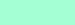
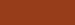
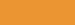
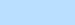

GDSCript Lang Dev-Notes
=======================

Some notes on the making of GDScript language definition for Highlight. Might be useful for maintaining future versions of the file, or for porting it to another syntax highlighter.

    Last edited: 2017-02-17

------------------------------------------------------------------------

<!-- #toc -->
-   [Introduction](#introduction)
    -   [A Note for Maintainers](#a-note-for-maintainers)
    -   [A Note for Porters](#a-note-for-porters)
-   [Keywords](#keywords)
    -   [List of Reserved Keywords](#list-of-reserved-keywords)
    -   [List of Built-In Functions](#list-of-built-in-functions)
-   [Base Types](#base-types)
    -   [List of Base Types](#list-of-base-types)
-   [Comments](#comments)
-   [Identifiers](#identifiers)
-   [Numbers](#numbers)
-   [Operators](#operators)
-   [Strings](#strings)
    -   [String Delimiters](#string-delimiters)
    -   [Escape Sequences](#escape-sequences)
    -   [Format Strings](#format-strings)
-   [Member Variables](#member-variables)
-   [Functions](#functions)

<!-- /toc -->

------------------------------------------------------------------------

Introduction
============

These notes pertain to my Highlight implementation of GDScript lang definition. The notes are intended to help maintainers of this lang file, but they might be handy also for those interested in making a GDScript lang definition for other highlighting libraries.

During the dev stage I’ve relied on Godot source files to get a full list of the various keywords and to gain insight on how elements are implemented. You’ll find here all the links to the relevant source files, so it will be easier to integrate new GDScript features into the lang definition.

> **NOTE**: References to line numbers of Godot source code files are aproximative since these files will change in time. For this reason, a portion of the starting and ending lines of all mentioned source file blocks is reproduced here to help finding the referenced elements.

A Note for Maintainers
----------------------

If you’re looking for updating/maintaining the GDScript lang file for Highlight, read the relevant documentation:

-   [Highlight Wiki — Language definitions](http://andre-simon.de/dokuwiki/doku.php?id=en:langdef)
-   [Highlight Manual — Language definitions](http://andre-simon.de/doku/highlight/en/highlight.php#ch3_3)

A Note for Porters
------------------

If you’re planning to build a syntax file for another library bear in mind that some adaptations might be required as different highlighters implement different approaches.

The regular expressions found here were designed to work in Highlight, which uses the `Boost.Regex` library — pretty much like PCRE. If you’r porting to a language which uses a different RegEx engine you might have to check if the same syntaxes are supported.

-   [Highlight Manual — Regular expressions](http://andre-simon.de/doku/highlight/en/regex.php)
-   [Boost.Regex documentation](http://www.boost.org/doc/libs/1_32_0/libs/regex/doc/syntax.html)

Keywords
========

GDScript “keywords” are highlighted in “Portafino” color within Godot’s editor, and they correspond to the `keyword_color` in a Godot theme file.

| ELEMENT NAME    | HEX COLOR | PREVIEW                           | COLOR NAME |
|-----------------|-----------|-----------------------------------|------------|
| `keyword_color` | `#FFFFB3` |  | Portafino  |

The first part of the GDSCript keywords list was extracted from `gd_script.cpp` (lines: 1899–1947):

-   [`/modules/gdscript/gd_script.cpp`](https://github.com/godotengine/godot/blob/master/modules/gdscript/gd_script.cpp#L1899)

``` cpp
static const char *_reserved_words[]={
    // operators
    "and",
    "in",
    "not",
    "or",
    // types and values
    "false",
    "float",

    [...etc...]

    0};
```

> **NOTE**: A similar list can also be found in `gd_tokenizer.cpp` (lines: 860–905), but the former list suits better the task at hand:
>
> -   [`/modules/gdscript/gd_tokenizer.cpp`](https://github.com/godotengine/godot%3E%20/blob/master/modules/gdscript/gd_tokenizer.cpp#L860)

The second part — ie: the list of built-in functions — was extracted from `gd_functions.cpp` (lines: 44-115):

-   [`/modules/gdscript/gd_functions.cpp`](https://github.com/godotengine/godot/blob/master/modules/gdscript/gd_functions.cpp#L44)

``` cpp
static const char *_names[FUNC_MAX]={
    "sin",
    "cos",
    "tan",

    [...etc...]

    };
```

List of Reserved Keywords
-------------------------

This is the full ordered list of all the extracted keyword, grouped into sections:

-   OPERATORS
    -   `and`
    -   `in`
    -   `not`
    -   `or`
-   TYPES AND VALUES
    -   `bool`
    -   `false`
    -   `float`
    -   `int`
    -   `null`
    -   `PI`
    -   `self`
    -   `true`
-   FUNCTIONS
    -   `assert`
    -   `breakpoint`
    -   `class`
    -   `extends`
    -   `func`
    -   `preload`
    -   `setget`
    -   `signal`
    -   `tool`
    -   `yield`
-   VAR
    -   `const`
    -   `enum`
    -   `export`
    -   `onready`
    -   `static`
    -   `var`
-   CONTROL FLOW
    -   `break`
    -   `continue`
    -   `elif`
    -   `else`
    -   `for`
    -   `if`
    -   `master`
    -   `match`
    -   `pass`
    -   `remote`
    -   `return`
    -   `slave`
    -   `sync`
    -   `while`

List of Built-In Functions
--------------------------

And this is the full ordered list of all the extracted built-in functions:

-   `abs`
-   `acos`
-   `asin`
-   `atan`
-   `atan2`
-   `bytes2var`
-   `ceil`
-   `char`
-   `clamp`
-   `Color8`
-   `ColorN`
-   `convert`
-   `cos`
-   `cosh`
-   `db2linear`
-   `decimals`
-   `dectime`
-   `deg2rad`
-   `dict2inst`
-   `ease`
-   `exp`
-   `floor`
-   `fmod`
-   `fposmod`
-   `funcref`
-   `hash`
-   `inst2dict`
-   `instance_from_id`
-   `is_inf`
-   `is_nan`
-   `lerp`
-   `linear2db`
-   `load`
-   `log`
-   `max`
-   `min`
-   `nearest_po2`
-   `parse_json`
-   `pow`
-   `print`
-   `print_stack`
-   `printerr`
-   `printraw`
-   `prints`
-   `printt`
-   `rad2deg`
-   `rand_range`
-   `rand_seed`
-   `randf`
-   `randi`
-   `randomize`
-   `range`
-   `round`
-   `seed`
-   `sign`
-   `sin`
-   `sinh`
-   `sqrt`
-   `stepify`
-   `str`
-   `str2var`
-   `tan`
-   `tanh`
-   `to_json`
-   `type_exists`
-   `typeof`
-   `validate_json`
-   `var2bytes`
-   `var2str`
-   `weakref`

Base Types
==========

GDScript “base types” (aka “core types”) are highlighted in “Aquamarine” color within Godot’s editor, and they correspond to the `base_type_color` in a Godot theme file.

| ELEMENT NAME      | HEX COLOR | PREVIEW                            | COLOR NAME |
|-------------------|-----------|------------------------------------|------------|
| `base_type_color` | `#A3FFD4` |  | Aquamarine |

The full list of GDScript “core types” (aka “base types”) was extracted from `script_text_editor.cpp` (lines: 139–153)

-   [`/tools/editor/plugins/script_text_editor.cpp`](https://github.com/godotengine/godot/blob/master/tools/editor/plugins/script_text_editor.cpp#L139)

``` cpp
//colorize core types
Color basetype_color= EDITOR_DEF("text_editor/highlighting/base_type_color",Color(0.3,0.3,0.0));

text_edit->add_keyword_color("Vector2",basetype_color);
text_edit->add_keyword_color("Vector3",basetype_color);
text_edit->add_keyword_color("Plane",basetype_color);
text_edit->add_keyword_color("Quat",basetype_color);
text_edit->add_keyword_color("AABB",basetype_color);
text_edit->add_keyword_color("Matrix3",basetype_color);
text_edit->add_keyword_color("Transform",basetype_color);
text_edit->add_keyword_color("Color",basetype_color);
text_edit->add_keyword_color("Image",basetype_color);
text_edit->add_keyword_color("InputEvent",basetype_color);
text_edit->add_keyword_color("Rect2",basetype_color);
text_edit->add_keyword_color("NodePath",basetype_color);
```

List of Base Types
------------------

This is the full ordered list of all the extracted base types:

-   `AABB`
-   `Color`
-   `Image`
-   `InputEvent`
-   `Matrix3`
-   `NodePath`
-   `Plane`
-   `Quat`
-   `Rect2`
-   `Transform`
-   `Vector2`
-   `Vector3`

Comments
========

GDScript comments are highlighted in “Cumin” color within Godot’s editor, and they correspond to the `comment_color` in a Godot theme file.

| ELEMENT NAME    | HEX COLOR | PREVIEW                       | COLOR NAME |
|-----------------|-----------|-------------------------------|------------|
| `comment_color` | `#973D1A` |  | Cumin      |

GDScript has only single-line comments, starting with a hash symbol (`#`). In Highlight is sufficient to define the comments delimiter with “`#`”:

``` lua
Comments={
   { Block=false,
     Nested=false,
     Delimiter = { [[#]] }
   }
}
```

> **NOTE**: Other syntax highlighters might require a full RegEx to capture all characters up to the end of line — eg: `#.*$`.

Identifiers
===========

Since GDScript identifiers follow standard rules, there was no need to provide a definition in Highlight. Possibly, most highlighter libraries defaults will also work. If not — or whenever you need to define inside a RegEx a GDScript identifier — this is the RegEx needed:

    ([a-zA-Z_][a-zA-Z_0-9]*)

Numbers
=======

GDScript numbers are highlighted in “Carrot Orange” color within Godot’s editor, and they correspond to the `number_color` in a Godot theme file.

| ELEMENT NAME   | HEX COLOR | PREVIEW                               | COLOR NAME    |
|----------------|-----------|---------------------------------------|---------------|
| `number_color` | `#EB9531` |  | Carrot Orange |

Highlight defaults are good enough to cover GDScript numbers syntax, so there was no need to define a custom `Digits` syntax.

Operators
=========

-   [Godot Docs: Operators](http://docs.godotengine.org/en/stable/reference/gdscript.html#operators)

GDScript operators characters fall under the “symbols” category and are highlighted in “Tropical Blue” color within Godot’s editor, and they correspond to the `symbol_color` in a Godot theme file.

| ELEMENT NAME   | HEX COLOR | PREVIEW                               | COLOR NAME    |
|----------------|-----------|---------------------------------------|---------------|
| `symbol_color` | `#BADFFF` |  | Tropical Blue |

Thery are defined in the Highlight lang file with a single RegEx:

``` lua
Operators=[[\(|\)|\[|\]|\{|\}|\,|\;|\.|\:|\&|\^|\||<|>|\!|\=|\/|\*|\%|\+|\-|\@]]
```

> **NOTE**: The `@` literal symbol used for NodePaths or StringNames belongs to this category even though is not an operator.

Strings
=======

-   [Godot Docs: Strings](http://docs.godotengine.org/en/stable/reference/gdscript.html#string)

All GDScript string types are highlighted in “Hot Pink” color within Godot’s editor, and they correspond to the `string_color` in a Godot theme file.

| ELEMENT NAME   | HEX COLOR | PREVIEW                          | COLOR NAME |
|----------------|-----------|----------------------------------|------------|
| `string_color` | `#EF6EBD` |  | Hot Pink   |

This is the code used for defining GDScript strings in Highlight lang file:

``` lua
Strings={
  Delimiter=[["""|'''|"|']],
  Escape=[=[\\[abtnvfr'"\\/"]|\\u[[:xdigit:]]{4}]=],
  Interpolation=[[ (?<!%)%[0-9-+*.]{0,}[scdoxXf] ]]
```

String Delimiters
-----------------

GDScript supports strings (delimited by a pair of double `"` or single `'` quotes) and multiline strings (delimited by a pair of three consecutive double `"""` or single `''''` quotes).

A single RegEx should cover all string delimiters in most syntax highlighters: `"""|'''|"|'`

Escape Sequences
----------------

-   [Wikipedia: Escape sequences in C](https://en.wikipedia.org/wiki/Escape_sequences_in_C)

> Strings can contain the standard C escape sequences.

GDScript escape sequences rules can be grasped by looking into Godot’s source code at `gd_tokenizer.cpp` (lines: 595–):

-   [/modules/gdscript/gd\_tokenizer.cpp](https://github.com/godotengine/godot/blob/master/modules/gdscript/gd_tokenizer.cpp#L595)

``` cpp
//escaped characters...
i++;
CharType next = GETCHAR(i);
if (next==0) {
    _make_error("Unterminated String");
    return;
}
CharType res=0;

switch(next) {

    case 'a': res=7; break;
    case 'b': res=8; break;
    case 't': res=9; break;
    case 'n': res=10; break;
    case 'v': res=11; break;
    case 'f': res=12; break;
    case 'r': res=13; break;
    case '\'': res='\''; break;
    case '\"': res='\"'; break;
    case '\\': res='\\'; break;
    case '/': res='/'; break; //wtf

    case 'u': {
        //hexnumbarh - oct is deprecated
        i+=1;
        for(int j=0;j<4;j++) {
            CharType c = GETCHAR(i+j);
            if (c==0) {
                _make_error("Unterminated String");
                return;
            }

        [...]

        }
        i+=3;
    } [...]
}
```

From the above code we infer that:

-   The following escape sequences are supported:
    -   `\a`, `\b`, `\t`, `\n`, `\v`, `\f`, `\r`, `\'`, `\"`, `\\`, `\/`

    -   `\uhhhh` (universal character names): “`\u`” followed by four hex digits (`h`) representing a Unicode code point.

-   Hexadecimal (`\xhh...`) and Octal (`\nnn`) escape sequences are unsupported as they appear to be depreacted in GDScript (see comment at line 619).

Format Strings
--------------

-   [Godot Docs: Format Strings](http://docs.godotengine.org/en/stable/reference/gdscript_printf.html)

> GDScript supports format strings aka printf functionality.

Defined in Highlight lang file by the `Interpolation` RegEx: `(?<!%)%[0-9-+*.]{0,}[scdoxXf]`

The `(?<!%)%` part ensures that escaping a `%` is respected. The rest of the RegEx is a simplification of all the various GDScript format string rules and will capture all well formatted format strings (for that matter, it will also capture badly formatted ones, but with syntax highlighters we give for granted that the input code is syntactically correct).

Member Variables
================

GDScript member variables are highlighted in “Mandy” color within Godot’s editor, and they correspond to the `member_variable_color` in a Godot theme file.

| ELEMENT NAME            | HEX COLOR | PREVIEW                       | COLOR NAME |
|-------------------------|-----------|-------------------------------|------------|
| `member_variable_color` | `#E64D59` |  | Mandy      |

They are capture with the following RegEx: `(?<=\.)([a-zA-Z_][a-zA-Z_0-9]*)`

Basically, it just uses a positve lookbehind (`(?<=\.)`) to check if an identifier (`([a-zA-Z_][a-zA-Z_0-9]*)`) is preceded by a dot.

Functions
=========

GDScript function names are highlighted in “Danube” color within Godot’s editor, and they correspond to the `function_color` in a Godot theme file.

| ELEMENT NAME     | HEX COLOR | PREVIEW                        | COLOR NAME |
|------------------|-----------|--------------------------------|------------|
| `function_color` | `#66A1CD` |  | Danube     |

Function names are captured with the following RegEx:

    ([a-zA-Z_][a-zA-Z_0-9]*)(?:(\s*)?\()

Basically, we capture any identifier (`([a-zA-Z_][a-zA-Z_0-9]*)`) which is followed by an opening round bracket (`\(`) — also allowing spaces between them (`(\s*)?`).

> **NOTE**: Some syntax highlighters only allow to highlight function names when the function is being defined or declared, but don’t allow highlighting function calls!
