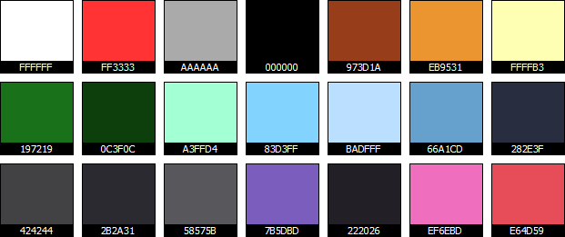

Godot Theme Dev-Notes
=====================

I wanted to create a Highlight theme mimicking Godot Editor’s default theme, so that GDScript snippets in tutorials and web-pages would have the typical native look and feel associated with Godot engine.

Here you’ll find my work notes on how I extracted from Godot’s editor the color palette of its default theme, along with a full list of the palette colors’ names and values.

    Last edited: 2017-02-17

------------------------------------------------------------------------

<!-- #toc -->
-   [Extracting the Color Palette](#extracting-the-color-palette)
-   [The Full Color Palette](#the-full-color-palette)
    -   [Godot Palette Resources](#godot-palette-resources)
-   [Building a Theme](#building-a-theme)
-   [Reference Links](#reference-links)

<!-- /toc -->

------------------------------------------------------------------------

Extracting the Color Palette
============================

From within Godot editor I chose the **File** &gt; **Save Theme As** menu and exported the default theme. The exported file (`Default.tet`) contained the following settings:

    [color_theme]

    background_color="3b000000"
    base_type_color="ffa3ffd4"
    brace_mismatch_color="ffff3333"
    breakpoint_color="33cccc66"
    caret_background_color="ff000000"
    caret_color="ffaaaaaa"
    comment_color="ff973d1a"
    completion_background_color="ff2b2a31"
    completion_existing_color="21dfdfdf"
    completion_font_color="ffaaaaaa"
    completion_scroll_color="ffffffff"
    completion_selected_color="ff424244"
    current_line_color="264c7fcc"
    engine_type_color="ff83d3ff"
    function_color="ff66a1cd"
    keyword_color="ffffffb3"
    line_number_color="66aaaaaa"
    mark_color="66ff6666"
    member_variable_color="ffe64d59"
    number_color="ffeb9531"
    search_result_border_color="ff197219"
    search_result_color="ff0c3f0c"
    selection_color="ff7b5dbd"
    string_color="ffef6ebd"
    symbol_color="ffbadfff"
    text_color="ffaaaaaa"
    text_selected_color="ff000000"
    word_highlighted_color="26cce5e5"

As you might notice, these are ARGB hex color definitions, therefore the actual color you see in Godot’s IDE depends on wether the color has transparency or not — the first two digits represent the Alpha chanel, so when any of the above colors begins with `ff` you have a fully opaque color, and the remaining six hex digits represent the color as seen on screen. When the first two digits are anything else than `ff`, the actual color has to be grabed directly from the Editor screen, with some color picking tool.

The Full Color Palette
======================

I’ve therefore worked out a partial list of all the above colors, as they truly appear in the Editor. I’ve also calculated and added the color names using my free tool [Name That Color (NTC)](https://github.com/tajmone/name-that-color).

| ELEMENT NAME                  | HEX COLOR | PREVIEW                                 | COLOR NAME      |
|-------------------------------|-----------|-----------------------------------------|-----------------|
| `background_color`            | `#222026` |       | Baltic Sea      |
| `base_type_color`             | `#A3FFD4` |       | Aquamarine      |
| `brace_mismatch_color`        | `#FF3333` |       | Red Orange      |
| `breakpoint_color`            | ???       |                                         |                 |
| `caret_background_color`      | `#000000` |            | Black           |
| `caret_color`                 | `#AAAAAA` |   | Silver Chalice  |
| `comment_color`               | `#973D1A` |            | Cumin           |
| `completion_background_color` | `#2B2A31` |            | Shark           |
| `completion_existing_color`   | ???       |   | Silver Chalice  |
| `completion_font_color`       | `#AAAAAA` |   | Silver Chalice  |
| `completion_scroll_color`     | `#FFFFFF` |            | White           |
| `completion_selected_color`   | `#424244` |           | Masala          |
| `current_line_color`          | `#282E3F` |       | Ebony Clay      |
| `engine_type_color`           | `#83D3FF` |           | Malibu          |
| `function_color`              | `#66A1CD` |           | Danube          |
| `keyword_color`               | `#FFFFB3` |        | Portafino       |
| `line_number_color`           | `#58575B` |            | Abbey           |
| `mark_color`                  | ???       |                                         |                 |
| `member_variable_color`       | `#E64D59` |            | Mandy           |
| `number_color`                | `#EB9531` |    | Carrot Orange   |
| `search_result_border_color`  | `#197219` |  | Japanese Laurel |
| `search_result_color`         | `#0C3F0C` |        | Dark Fern       |
| `selection_color`             | `#7B5DBD` |     | Fuchsia Blue    |
| `string_color`                | `#EF6EBD` |         | Hot Pink        |
| `symbol_color`                | `#BADFFF` |    | Tropical Blue   |
| `text_color`                  | `#AAAAAA` |   | Silver Chalice  |
| `text_selected_color`         | `#000000` |            | Black           |
| `word_highlighted_color`      | ???       |                                         |                 |

This is is the full colors palette:

Godot Palette Resources
-----------------------

In the [`/palettes/`](./palettes/) folder you’ll find Godot’s theme palette in different file formats:

-   [`godot-theme-palette.aco`](./palettes/godot-theme-palette.aco) — Photoshop palette.
-   [`godot-theme-palette.cifc`](./palettes/godot-theme-palette.cifc) — [ColorImpact 4](http://www.tigercolor.com/ColorImpact.htm) palette file.
-   [`godot-theme-palette.cs`](./palettes/godot-theme-palette.cs) — [ColorSchemer Studio 2](http://www.colorschemer.com/studio_info.php) palette file.
-   [`godot-theme-palette.css`](./palettes/godot-theme-palette.css) — CSS stylesheet with color names as classes.
-   [`godot-theme-palette.gif`](./palettes/godot-theme-palette.gif) — Gif file with swatches and Hex values.
-   [`godot-theme-palette.htm`](./palettes/godot-theme-palette.htm) — HTML palette with colors names, RGB, Hex and HSB values.
-   [`godot-theme-palette.txt`](./palettes/godot-theme-palette.txt) — Text file with colors names, RGB, Hex, HSB and HSL values.
-   [`godot-theme-palette.xml`](./palettes/godot-theme-palette.xml) — XML palette with colors names, RGB and Hex values.

Building a Theme
================

Unless you’re making a theme for a code editor, the full palette has more color than you’ll actually need for a syntax highlighter theme. In most cases, the following colors will be all you need:

| ELEMENTS            | HEX COLOR | PREVIEW                                | COLOR NAME     |
|---------------------|-----------|----------------------------------------|----------------|
| Canvas BG           | `#222026` |      | Baltic Sea     |
| Text default        | `#AAAAAA` |  | Silver Chalice |
| Operators & Symbols | `#BADFFF` |   | Tropical Blue  |
| Comments            | `#973D1A` |           | Cumin          |
| Numbers             | `#EB9531` |   | Carrot Orange  |
| Strings             | `#EF6EBD` |        | Hot Pink       |
| Keywords            | `#FFFFB3` |       | Portafino      |
| Core types          | `#A3FFD4` |      | Aquamarine     |
| Function names      | `#66A1CD` |          | Danube         |
| Member variables    | `#E64D59` |           | Mandy          |

Some highlighters allow extra features such as line numbers, text selections, etc. These colors should cover most of them:

| ELEMENTS        | HEX COLOR | PREVIEW                              | COLOR NAME   |
|-----------------|-----------|--------------------------------------|--------------|
| Line numbers    | `#58575B` |         | Abbey        |
| Current line BG | `#282E3F` |    | Ebony Clay   |
| Selection BG    | `#7B5DBD` |  | Fuchsia Blue |
| Selection FG    | `#000000` |         | Black        |
| Error           | `#FF3333` |    | Red Orange   |

Reference Links
===============

Links to Highlight themes documentation:

-   [Highlight Wiki — Colour Themes](http://andre-simon.de/dokuwiki/doku.php?id=en:themes)
-   [Highlight Manual — Theme definitions](http://andre-simon.de/doku/highlight/en/highlight.php#ch3_4)

Links to color tools used during development.

-   [Name That Color (NTC)](https://github.com/tajmone/name-that-color) — (Free open source) command line tool that returns the color name of an Hex or RGB color value.
-   [ColorSchemer Studio 2](http://www.colorschemer.com/studio_info.php) — (Commercial) tool for managing color palettes and creating color schemes.
-   [ColorImpact 4](http://www.tigercolor.com/ColorImpact.htm) — (Commercial) tool for managing color palettes and creating color schemes.

