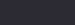
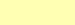
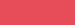
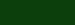
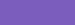

Godot Theme Dev-Notes
=====================

    UNDER CONSTRUCTION! TO BE COMPLETED SOON...

Introduction
============

I wanted to create a Highlight theme mimicking Godot Editor’s default theme, so that GDScript snippets in tutorials and web-pages would have the typical native look and feel associated with using Godot engine.

Extracting the Color Palette
============================

From within Godot editor I chose the “**File** &gt; **Save Theme As**” menu and exported the default theme. The exported file (`Default.tet`) contained the following settings:

    [color_theme]

    background_color="3b000000"
    base_type_color="ffa3ffd4"
    brace_mismatch_color="ffff3333"
    breakpoint_color="33cccc66"
    caret_background_color="ff000000"
    caret_color="ffaaaaaa"
    comment_color="ff973d1a"
    completion_background_color="ff2b2a31"
    completion_existing_color="21dfdfdf"
    completion_font_color="ffaaaaaa"
    completion_scroll_color="ffffffff"
    completion_selected_color="ff424244"
    current_line_color="264c7fcc"
    engine_type_color="ff83d3ff"
    function_color="ff66a1cd"
    keyword_color="ffffffb3"
    line_number_color="66aaaaaa"
    mark_color="66ff6666"
    member_variable_color="ffe64d59"
    number_color="ffeb9531"
    search_result_border_color="ff197219"
    search_result_color="ff0c3f0c"
    selection_color="ff7b5dbd"
    string_color="ffef6ebd"
    symbol_color="ffbadfff"
    text_color="ffaaaaaa"
    text_selected_color="ff000000"
    word_highlighted_color="26cce5e5"

As you might notice, these are ARGB hex color definitions, therefore the actual color you see in Godot’s IDE depends on wether the color has transparency or not — the first two digits represent the Alpha chanel, so when any of the above colors begins with `ff` you have a fully opaque color, and the remaining six hex digits represent the color as seen on screen. When the first two digits are anything else than `ff`, the actual color has to be grabed directly from the Editor screen, with some color picking tool.

I’ve therefore worked out a partial list of all the above colors, as they truly appear in the Editor. I’ve also found their color names using NTC (Name That Color) tool.

| ELEMENT NAME                  | HEX COLOR | PREVIEW                                 | COLOR NAME        |
|-------------------------------|-----------|-----------------------------------------|-------------------|
| `background_color`            | `#222026` |       | “Baltic Sea”      |
| `base_type_color`             | `#A3FFD4` |       | “Aquamarine”      |
| `brace_mismatch_color`        | `#FF3333` |       | “Red Orange”      |
| `breakpoint_color`            | ???       |                                         |                   |
| `caret_background_color`      | `#000000` |            | “Black”           |
| `caret_color`                 | `#AAAAAA` |   | “Silver Chalice”  |
| `comment_color`               | `#973D1A` |            | “Cumin”           |
| `completion_background_color` | `#2B2A31` |            | “Shark”           |
| `completion_existing_color`   | ???       |   | “Silver Chalice”  |
| `completion_font_color`       | `#AAAAAA` |   | “Silver Chalice”  |
| `completion_scroll_color`     | `#FFFFFF` |            | “White”           |
| `completion_selected_color`   | `#424244` |           | “Masala”          |
| `current_line_color`          | `#282E3F` |       | “Ebony Clay”      |
| `engine_type_color`           | `#83D3FF` |           | “Malibu”          |
| `function_color`              | `#66A1CD` |           | “Danube”          |
| `keyword_color`               | `#FFFFB3` |        | “Portafino”       |
| `line_number_color`           | `#58575B` |            | “Abbey”           |
| `mark_color`                  | ???       |                                         |                   |
| `member_variable_color`       | `#E64D59` |            | “Mandy”           |
| `number_color`                | `#EB9531` |    | “Carrot Orange”   |
| `search_result_border_color`  | `#197219` |  | “Japanese Laurel” |
| `search_result_color`         | `#0C3F0C` |        | “Dark Fern”       |
| `selection_color`             | `#7B5DBD` |     | “Fuchsia Blue”    |
| `string_color`                | `#EF6EBD` |         | “Hot Pink”        |
| `symbol_color`                | `#BADFFF` |    | “Tropical Blue”   |
| `text_color`                  | `#AAAAAA` |   | “Silver Chalice”  |
| `text_selected_color`         | `#000000` |            | “Black”           |
| `word_highlighted_color`      | ???       |                                         |                   |

This is is the full colors palette:

